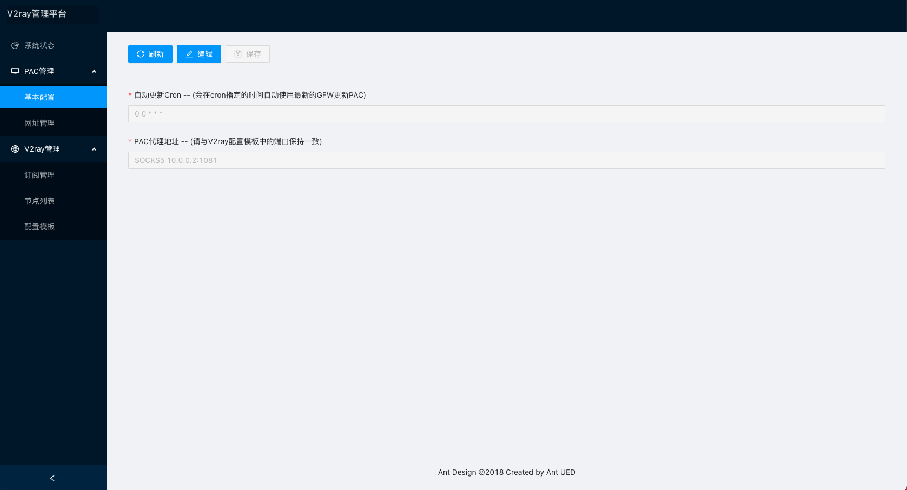
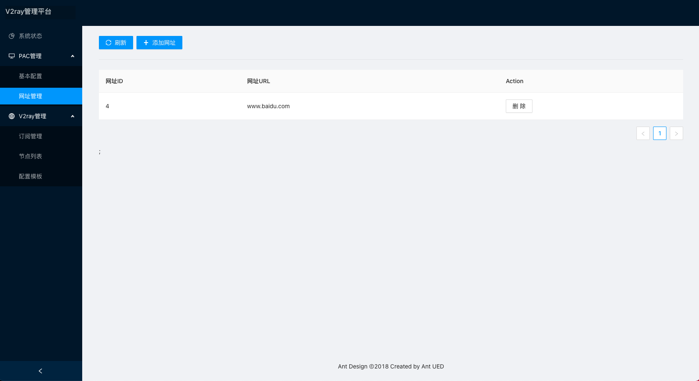
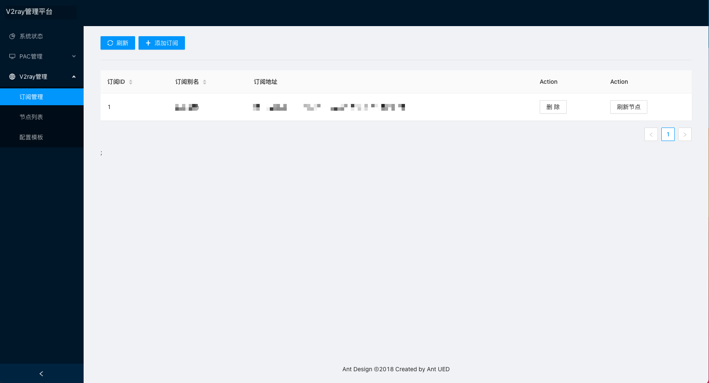
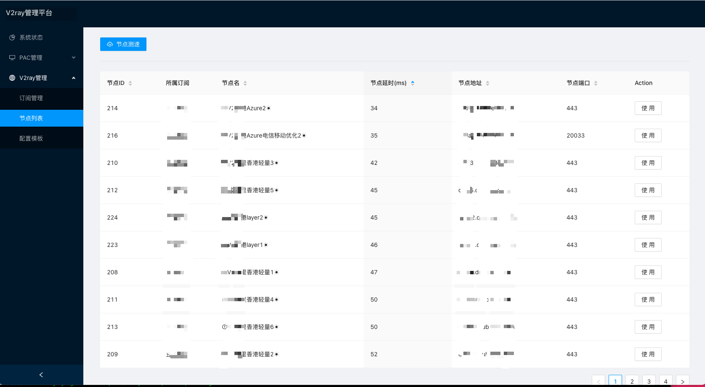
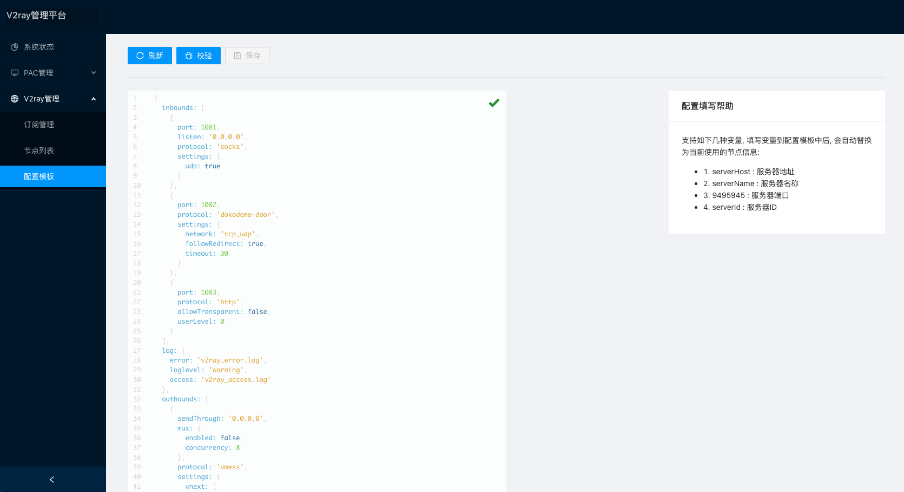

## v2ray-webui
[](https://goreportcard.com/report/github.com/cntechpower/v2ray-webui)  
### 为何创建这个项目?
软路由(x86-ubuntu)上原来使用命令行启动 [v2ray](https://github.com/v2ray/v2ray-core) 客户端,日常启动/修改配置需要SSH登陆手动操作.  
由于不同地区的v2ray服务器有各自的适用场景,所以在使用场景切换时,经常需要大量重复性操作.
* 美西带宽大, 适合下载
* 香港延迟低, 适合日常应用  

传统的命令行+配置文件启动v2ray的方式, 无法满足快速切换线路的需求. 而且没有发现现有的开源v2ray web客户端工具.

### 功能列表
* 1.提供v2ray客户端的webui.
* 2.支持v2ray订阅, 支持节点测速
* 3.支持页面修改v2ray配置模板
* 4.集成PAC生成功能 using [genpac](https://github.com/JinnLynn/genpac). 支持定时生成, 支持自定义代理站点.

### 支持平台
* x86-linux
  * 经x86(Ubuntu Server)测试
* arm-linux
  * 经树莓派4B(Ubuntu Server)测试
其他平台欢迎补充兼容性报告


### 如何安装?
请移步Actions中的中的Build, 从Artifacts中下载  
下载安装包后, 使用如下命令进行安装
```sh
mkdir /usr/local/v2ray-webui
tar -xvf v2ray-webui-ede294b.tar.gz -C /usr/local/v2ray-webui
cat << EOF > /etc/systemd/system/v2ray-webui.service
[Unit]
Description="v2ray-webui - A v2ray web client"
Documentation=https://github.com/cntechpower/v2ray-webui
Requires=network-online.target
After=network-online.target


[Service]
Type=simple
User=root
WorkingDirectory=/usr/local/v2ray-webui
ExecStart=/usr/local/v2ray-webui/bin/v2ray-webui
Restart=on-failure
StandardOutput=append:/usr/local/v2ray-webui/std.log
StandardError=append:/usr/local/v2ray-webui/error.log
[Install]
WantedBy=multi-user.target
EOF

systemctl daemon-reload
systemctl start v2ray-webui.service
systemctl status v2ray-webui.service

```

### 截图
  
  
  



## 交流QQ群
QQ群: 172820073  
欢迎提出意见或建议
